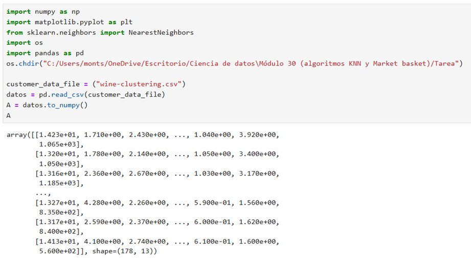
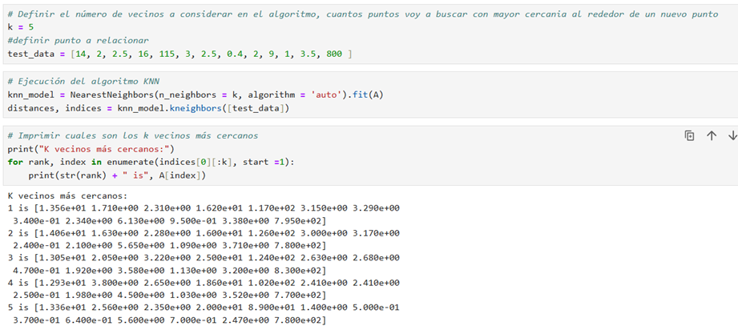
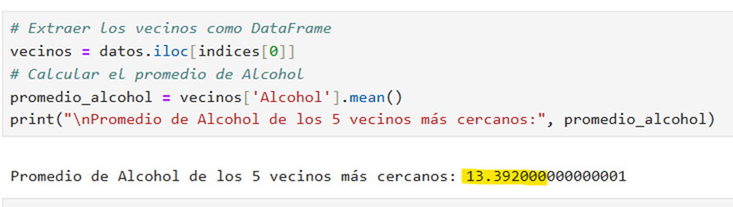
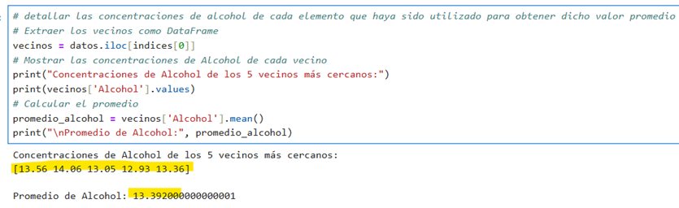
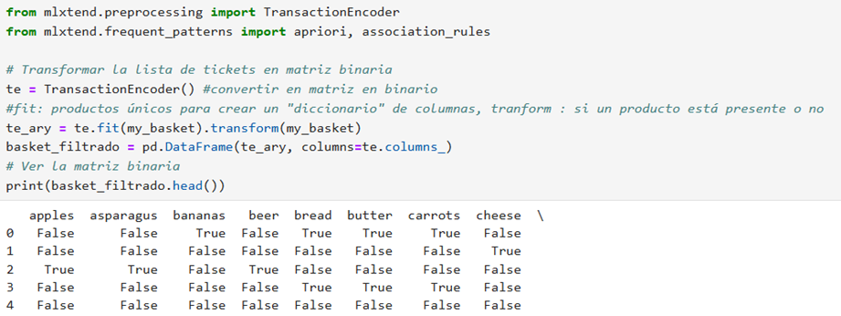
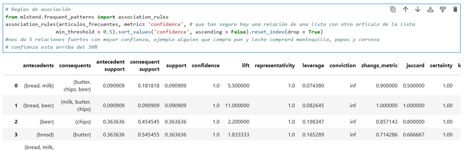

# the-market-knnbasket

## Algoritmo KNN
Aprenderemos sobre el algoritmo KNN, una técnica geométrica utilizada para agrupar observaciones basándose en características comunes. Este método es esencial para identificar grupos de pertenencia de nuevas observaciones mediante un sistema de votación, donde la elección del valor óptimo de K es crucial.

## Análisis de Market Basket
Nos centraremos en el análisis de Market Basket, que busca identificar reglas de asociación ocultas en grandes bases de datos. Este enfoque es valioso para descubrir patrones de compra que permitan optimizar la disposición de productos y ofrecer promociones estratégicas.

## Codificación y Reglas de Asociación
Exploraremos el proceso de análisis de datos de transacciones de compra mediante técnicas de codificación y algoritmos de asociación. Aprenderemos a codificar los datos en una matriz binaria y a aplicar el algoritmo "a priori" para evaluar la fuerza de las relaciones entre artículos comprados juntos.

## Práctica

El objetivo de esta actividad es que realices análisis de agrupación por “K vecinos más cercanos” y de patrones de consumo por “Market basket” a diversas bases de datos de manera que puedas generar conclusiones adecuadas.

### Paso a paso
Problema 1: la base de datos “wine-clustering.csv”  de la siguiente liga y agréguela a un DataFrame en Python.
Mediante el algoritmo de K vecinos más cercanos determine el valor promedio de alcohol que tendrían los 5 vinos más parecidos a aquel con las características siguientes:
Asegúrese de detallar las concentraciones de alcohol de cada elemento que haya sido utilizado para obtener dicho valor promedio. 

Problema 2: Considere la lista de 11 compras desglosada de la manera siguiente:
De acuerdo a la información anterior, se entiende que el primer ticket de compra de la lista consideró la adquisición de los siguientes productos: 
Modifica el código explicado en este módulo para que sea capaz de realizar un análisis mediante el algoritmo “Market basket” a dicha lista de compras con la finalidad de detectar patrones de consumo. Realice a continuación las conclusiones que sean pertinentes sobre sus resultados. 

> Nota importante: el programa debe ser capaz de correr cualquier lista de compras que venga en el mismo formato que el utilizado para esta actividad.

1.	Importamos todas las paqueterias necesarias, importamos el archivo de wine y lo convertimos en un arreglo
 

2.	Definimos el número de K vecinos a considerar en el algoritmo; en este caso usaremos el k = 5, para determinar cuantos puntos voy a buscar con mayor cercania al rededor de el nuevo punto que determinamos y ejecutamos **el algoritmo KNN**

 

3.	Determinamos el valor  promedio de alcohol que tendrían los 5 vinos más parecidos a aquel con las características que ya habíamos importado; el cual dio como resultado: 13.392

 

4.	Vamos a detallar las concentraciones de alcohol de cada elemento que haya sido utilizado para obtener dicho valor promedio; ese número es el valor promedio de Alcohol de los 5 vinos más parecidos al que definimos con test_data

 
**Market basket** 

5.	Creamos la matriz con los datos que se dieron y los convertimos en una matriz binaria

 
6.	Por último creamos reglas de asociación
 

### Conclusiones

El análisis de reglas de asociación revela que los clientes tienden a formar patrones de consumo consistentes gracias al algoritmo Apriori se puede concluir que los consumidores no compran productos de manera aislada, sino que forman grupos de artículos recurrentes. Estos patrones pueden aprovecharse para diferentes promociones, diseño de estands, recomendaciones personalizadas, etc.

Por ejemplo, se observa que pan y mantequilla se compran casi siempre juntos, lo que refleja un hábito básico y muy estable, otro ejemplo es la combinación de cerveza y papas fritas que aparece en prácticamente todas las transacciones donde hay cerveza, mostrando un patrón de consumo de bebidas y botanas.
Y para la parte de poder complementar puede ser cuando los clientes compran pan y leche, suelen complementar con mantequilla, chips y cerveza, lo que sugiere una mezcla de productos básicos.

